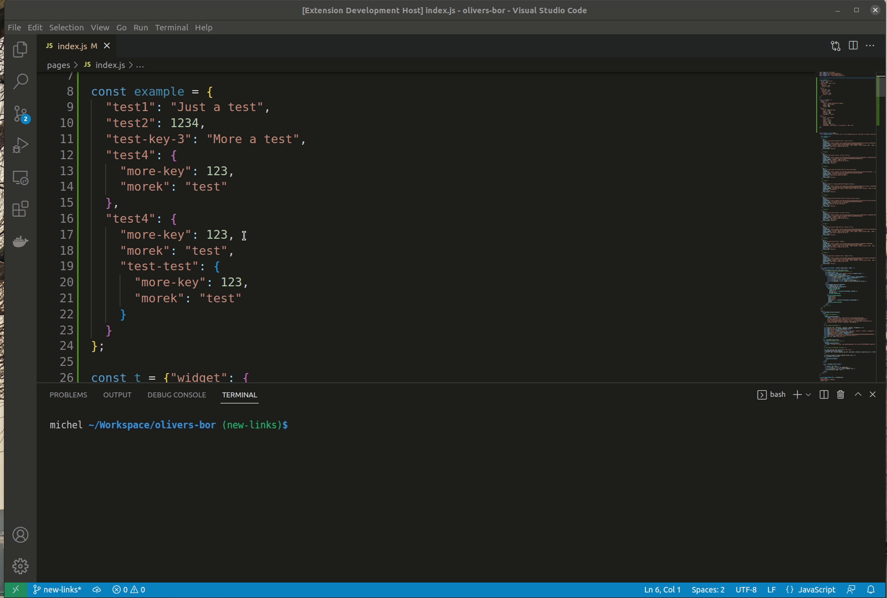

# Convert Json Format to Eslint

VSCode Extension to allow an easy way to select a json and convert it to eslint json format

## How it works
Is pretty simple, just select the json that you want convert and run the command "jconvert" in yours VSCode

To run the command you can use the shortcut "ctrl + shift + p"

See the example:

## Release Notes

### 0.1.0

Initial release of extension with basic use

-----------------------------------------------------------------------------------------------------------

## Known Issues

* Create error handler to exceptions
